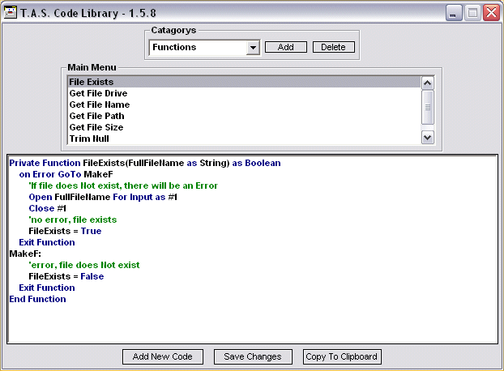



## A Fully Working Code Library Version 1\.6\.0\.7

### Description

A working code library that users can keep & organize a code collection within. Tuns of features !!! This version has a completly revamped data file format that is not compatible with my original version of this program. I found out that the original formating was bugy. This format has been tested with over a meg of data. The program has room for more improvement. The declairs also need work. Enjoy !!!
 
### More Info
 

             |
---                |---
**Submitted On**   |2004-08-04 19:50:40
**By**             |[Thomas Swift](https://github.com/Planet-Source-Code/PSCIndex/blob/master/ByAuthor/thomas-swift.md)
**Level**          |Beginner
**User Rating**    |4.7 (28 globes from 6 users)
**Compatibility**  |VB 6\.0
**Category**       |[Complete Applications](https://github.com/Planet-Source-Code/PSCIndex/blob/master/ByCategory/complete-applications__1-27.md)
**World**          |[Visual Basic](https://github.com/Planet-Source-Code/PSCIndex/blob/master/ByWorld/visual-basic.md)
**Archive File**   |[A\_Fully\_Wo177795842004\.zip](https://github.com/Planet-Source-Code/thomas-swift-a-fully-working-code-library-version-1-6-0-7__1-55361/archive/master.zip)

